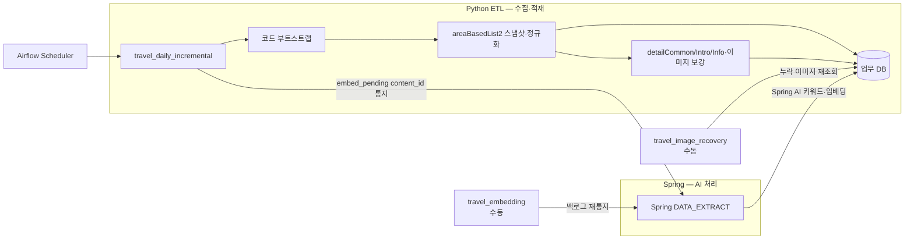

# Sodosiro-ETL

Airflow 기반 **ETL 오케스트레이션 서버**입니다. 여러 ETL 파이프라인을 **도메인 단위로 추가·운영**하며, FastAPI가 API 계층을 담당합니다.

- **오케스트레이션**: Airflow (webserver + scheduler)
- **API 계층**: FastAPI (`src/main.py`) — 설정은 루트 `.env`에서 로드 (`src/core/config.py`)
- **구조**: 도메인 디렉토리 방식 (`src/domains/*`) — ETL 하나 = 도메인 하나

## ETL 파이프라인

새 수집 대상이 생기면 기존 코드를 건드리지 않고 `src/domains/<파이프라인>` 도메인과 DAG를 하나 더 얹는 구조입니다. 각 파이프라인은 독립적으로 스케줄·실행됩니다.

### 현재 파이프라인: 여행지 데이터 ETL

계층은 `controller`(Airflow 진입점) → `service`(업무 흐름) → `repository`/`client`(DB·외부 연동)로 분리되어 있고, DAG 파일은 `_travel_tasks.py`의 얇은 콜러블만 연결합니다.

**1. 코드 부트스트랩** — 신규 환경(시군구 코드 없음)에서만 법정동 코드(`ldongCode2`)·신규 분류(`lclsSystmCode2`) 코드표를 동기화합니다. 이미 있으면 API 호출 없이 통과합니다.

**2. 원천 스냅샷·정규화** — `areaBasedList2` 응답 전체를 CSV로 보존한 뒤, 해당 파일을 읽어 검증·정규화하고 변경분만 업무 DB에 UPSERT 합니다.

목록 스냅샷은 기본적으로 페이지당 500건(`PUBLIC_DATA_PAGE_SIZE=500`)을 요청해 API 호출 횟수를 줄입니다. 공공 API가 이 값을 거절하는 경우 환경변수로 낮춰 조정할 수 있습니다. 변경 판별은 검색 대상 필드로 만든 `content_hash`(→ `etl_spot_state`)로 하며, 신규이거나 해시가 달라진 행만 적재합니다.

**3. 상세 보강** — 변경분에 한해 `detailCommon2`/`detailIntro2`/`detailInfo2`/`detailImage2`를 각각 독립 pending 큐(`etl_spot_state`의 `*_pending` 플래그)로 처리합니다. 항목마다 독립 트랜잭션으로 커밋하며, 쿼터·429는 중단하고 나머지는 다음 실행으로 넘겨 유실 없이 이어갑니다.

**4. Spring 통지** — 상세 보강이 끝난(`embed_pending`) 여행지 content_id 를 Spring(DATA_EXTRACT)에 HTTP 콜백으로 전달합니다.
**AI 처리(대표 키워드·LLM·Spring AI 임베딩 → spot_embedding)는 Spring 책임**이며, 처리가 끝나면 Spring 이 `embed_pending` 을 내립니다
(계약: `docs/travel-ai-handoff.md`). 통지가 실패해도 pending 이 큐로 남아 다음 실행에서 다시 통지되므로 유실이 없습니다.

처리할 pending 이 없으면 후속 단계는 호출 없이 통과해 불필요한 API 호출을 줄입니다.

### DAG 구성

| DAG | 스케줄 | 역할 |
| --- | --- | --- |
| `travel_daily_incremental` | 매일 `5 0 * * *` (00:05 KST) | 코드 부트스트랩 → 스냅샷·정규화·적재 → 상세·이미지 보강 → Spring 통지까지 일일 증분 처리 |
| `travel_embedding` | 수동 트리거 | 상세 적재가 끝난 `embed_pending` 콘텐츠를 Spring AI에 통지 (백로그 재통지, 실행당 기본 10건) |
| `travel_image_recovery` | 수동 트리거 | `spot_image` 가 비었고 원천 무이미지로 확정되지 않은 콘텐츠만 `contentId` 로 재조회 |

일일 DAG의 상세 보강 태스크는 직렬로 연결됩니다 — 병렬이면 태스크별 호출 간격 제한이 각자 적용돼 원천 API 합산 호출 속도가 배수로 늘고 같은 행에 잠금 경합이 생기기 때문입니다.



> Airflow 메타데이터 DB와 각 파이프라인의 **업무 DB는 분리**합니다. Airflow 내부 DB를 업무 데이터 저장에 혼용하지 않습니다.
>
> 원천 CSV는 `TRAVEL_SNAPSHOT_DIR`에 논리 실행일별로 하나씩 저장합니다. 같은 실행일의 재시도·CS 재실행은 이미 완료된 스냅샷을 재사용합니다. Docker 기본값은 호스트의 `data/`를 마운트한 `/data/travel/raw`이며, 분산 worker 환경에서는 공유 볼륨 또는 객체 스토리지를 사용해야 합니다.
>
> 여행지 파이프라인의 상세 설계(증분 판별·AI 처리·실패 복구)는 `docs/travel-etl-flow.md`를 참고하세요.

## 폴더 아키텍처

애플리케이션 코드는 `src/`, 배포 관심사는 `docker/`로 분리합니다. ETL 파이프라인은 `src/domains/` 아래에 도메인으로 추가합니다.

```text
sodosiro-ETL/
├── src/                          # 애플리케이션 코드
│   ├── main.py                   # FastAPI 진입점 (uvicorn src.main:app)
│   ├── core/
│   │   └── config.py             # FastAPI 전역 설정 (.env 로드)
│   └── domains/                  # 도메인별 코드 (ETL 하나 = 도메인 하나)
│       ├── travel_etl/           # 여행지 수집·적재 도메인
│       │   ├── controller/       # Airflow 태스크 진입점(Facade) + dto/ 행 모델
│       │   ├── service/          # ETL 업무 흐름·정규화·스냅샷·호출 간격 제한
│       │   ├── repository/       # 업무 DB 접근 (UPSERT·pending 큐·실행 이력)
│       │   ├── client/           # TourAPI(공공데이터)·Spring HTTP 통신
│       │   └── config/           # 도메인 설정 (settings.py, 환경변수 로드)
│       └── airflow/              # Airflow 오케스트레이션 도메인
│           ├── dags/             # DAG 정의 (스케줄러가 마운트해서 읽음)
│           │   ├── _travel_tasks.py              # controller를 호출하는 얇은 태스크 콜러블
│           │   ├── travel_daily_incremental.py   # 일일 증분 (스케줄)
│           │   ├── travel_embedding.py           # Spring AI 통지 (수동)
│           │   └── travel_image_recovery.py      # 누락 이미지 복구 (수동)
│           ├── plugins/          # 커스텀 오퍼레이터·훅·플러그인
│           └── README.md
├── database/                     # 업무 DB 스키마·마이그레이션 (수동 적용)
│   └── migrations/               # 파일명 순서대로 psql로 1회씩 실행
├── docker/                       # 배포(인프라) 관심사 — 분리
│   ├── docker-compose.yaml       # Airflow webserver·scheduler (메타 DB는 외부 PostgreSQL)
│   ├── .env                      # UID / 로그인 계정 / DB URL / ETL 환경변수 (git 제외)
│   └── .env.example              # .env 작성용 템플릿
├── data/                         # 원천 CSV 스냅샷 (컨테이너에 /data 로 마운트)
├── .env                          # FastAPI 앱 + 로컬 실행 ETL 설정 (git 제외)
└── .env.example                  # .env 작성용 템플릿
```

- **`domains/airflow`** — 스케줄·DAG·플러그인 등 오케스트레이션 관련 코드를 모아둔 도메인입니다. compose가 이 도메인의 `dags/`, `plugins/`를 컨테이너로 마운트합니다.
- **`domains/travel_etl`** — Airflow 진입점(controller), 업무 흐름(service), DB(repository), 외부 연동(client)을 역할별로 분리한 여행지 ETL 도메인입니다.
- **새 ETL 추가 시** — `src/domains/<이름>/`에 수집·정규화·적재 로직을 두고, `domains/airflow/dags/`에 해당 도메인 함수를 호출하는 얇은 DAG를 추가합니다.

## 실행

### FastAPI (ETL 서버 API)

```bash
uvicorn src.main:app --reload
```

설정은 루트 `.env`에서 읽습니다 (`.env.example` 복사해서 사용). 예: `APP_NAME`, `DEBUG`.

### Airflow (오케스트레이션)

```bash
cd docker
docker compose up airflow-init                              # 최초 1회 (DB 마이그레이션 + admin 계정)
docker compose up -d airflow-webserver airflow-scheduler    # webserver + scheduler
```

- 웹 UI: http://localhost:8080 (기본 로그인 `airflow` / `airflow`, `.env`에서 변경)
- DB 연결은 `docker/.env`의 `AIRFLOW_DB_URL`로 설정합니다. Backend Compose의 공용 Docker 네트워크에서 `postgres:5432`를 사용합니다 (호스트 공개 포트 `5434`는 컨테이너 간 통신에 사용하지 않습니다).
- `airflow-init`의 `airflow db migrate`는 **Airflow 메타데이터 DB**를 마이그레이션합니다. 여행지 **업무 DB**는 별도이며 아래에서 스키마를 적용합니다.

### 업무 DB 스키마

여행지 ETL이 적재하는 업무 DB(`tourist_spot`·`spot_image`·`etl_spot_state`·`etl_run` 등)는 자동 마이그레이션 도구 없이 `database/migrations/`의 SQL을 파일명 순서대로 한 번씩 적용합니다.

- `000_initialize_travel_schema.sql` — 신규 DB에 전체 테이블·인덱스를 생성합니다. 모든 DDL이 `IF NOT EXISTS`라 기존 테이블·데이터는 변경하지 않습니다.
- `20260721_etl_run_composite_key.sql` — 기존 DB에서만 필요합니다. `etl_run` 기본 키를 `run_id`에서 `(dag_id, run_id)`로 **변경**하므로(기존 테이블 ALTER), 적용 전 `dag_id`가 NULL인 실행 이력을 보정하고 ETL 코드와 함께 배포해야 합니다.

```bash
psql "$TRAVEL_DB_URL" -v ON_ERROR_STOP=1 -f database/migrations/000_initialize_travel_schema.sql
psql "$TRAVEL_DB_URL" -v ON_ERROR_STOP=1 -f database/migrations/20260721_etl_run_composite_key.sql
```

> 적용 순서·주의사항은 `database/migrations/README.md`를 참고하세요.

## 운영 기준 (기본값)

파이프라인별로 조정하되, 기본 원칙은 다음과 같습니다.

| 항목 | 기준 |
| --- | --- |
| 타임존 | DAG에 명시적 `Asia/Seoul` 설정 |
| 동시 실행 | `max_active_runs=1` (실행 겹침 방지) |
| Catchup | `catchup=False`, 백필은 별도 DAG |
| 재시도 | 네트워크·5xx는 지수 백오프(`retries=2`), 데이터 검증 실패는 재시도 없이 격리 |
| 실행 타임아웃 | 태스크당 `execution_timeout=1h` (다음 실행까지 밀림 방지) |
| 호출 pacing | 원천 API 호출 간 최소 간격(`API_MIN_INTERVAL_SEC`, 컨테이너 기본 1.0초) 강제 |
| 배치 상한 | 상세 보강 `DETAIL_BATCH_LIMIT`(300), 이미지 복구 `IMAGE_RECOVERY_BATCH_LIMIT`(300), Spring 통지 `SPRING_NOTIFY_LIMIT`(10) 등 실행당 처리량 제한 |
| 비밀값 | Airflow Connection/Secret Backend 사용 (코드에 직접 기록 금지) |
