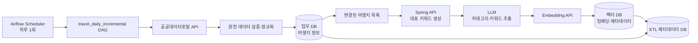
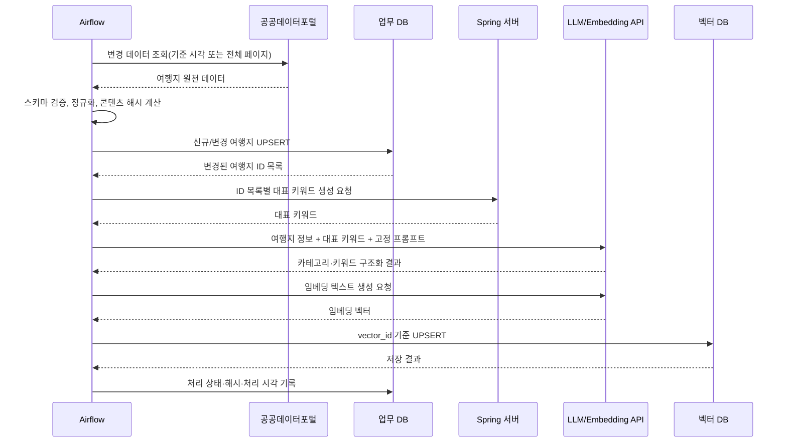
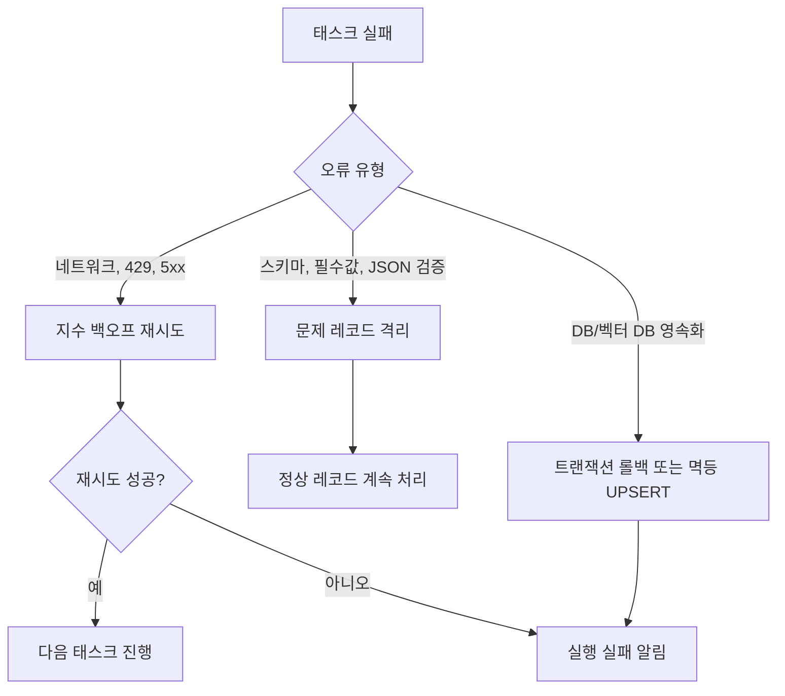

# 여행지 데이터 일일 증분 ETL 설계

## 1. 목적과 범위

이 문서는 여행지 정보를 최신 상태로 유지하고, 검색·추천에 사용할 키워드 및 벡터 임베딩을 생성하는 Airflow 기반 일일 ETL의 기준 설계다.

처리 대상은 다음과 같다.

1. 공공데이터포털에서 수집한 여행지 원천 데이터
2. 업무 데이터베이스에 저장되는 정규화된 여행지 정보
3. Spring 서버가 생성하는 여행지 대표 키워드
4. LLM 프롬프트로 추출하는 여행지 카테고리·키워드
5. 키워드와 여행지 정보를 임베딩한 벡터 데이터베이스 레코드

> 전제: 전달된 DDL의 실제 테이블명과 컬럼명은 구현 시 이 문서의 논리명(`travel_place`, `source_updated_at` 등)에 매핑한다. 특히 고유 키, 수정 시각, 삭제 상태, 벡터 DB의 메타데이터 필드를 먼저 확정해야 한다.

## 2. 목표 아키텍처



Airflow의 메타데이터 DB와 업무 DB는 분리한다. 현재 `docker/docker-compose.yaml`의 PostgreSQL은 Airflow 내부 메타데이터용이므로, 여행지 업무 DB를 그 DB와 혼용하지 않는다.

## 3. 일일 처리 흐름



### 권장 DAG 태스크

| 순서 | 태스크 ID | 책임 | 출력 |
| --- | --- | --- | --- |
| 1 | `start_run` | 실행 기준 시각과 `run_id` 생성, 이전 성공 watermark 조회 | `run_id`, 조회 범위 |
| 2 | `fetch_public_data` | 공공데이터포털 API 페이지 순회 및 원본 보존 | 원천 레코드 |
| 3 | `validate_normalize` | 필수값·좌표·형식 검증, 중복 제거, 표준 모델 변환 | 정규화 레코드 |
| 4 | `upsert_travel_places` | 외부 원천 ID 기준 UPSERT, 콘텐츠 해시 비교 | 변경 여행지 ID |
| 5 | `build_representative_keywords` | Spring 서버에 변경 ID만 전달하여 대표 키워드 생성 | 대표 키워드 |
| 6 | `extract_categories` | 고정 프롬프트와 JSON 스키마로 카테고리·키워드 추출 | 구조화 키워드 |
| 7 | `create_embeddings` | 버전이 포함된 임베딩 입력을 생성하고 벡터화 | 벡터, 메타데이터 |
| 8 | `upsert_vector_store` | 결정적 `vector_id`로 벡터 DB UPSERT | 저장 결과 |
| 9 | `finalize_run` | 성공 watermark 갱신, 건수·실패 항목 기록 | 실행 이력 |

`upsert_travel_places` 결과가 비어 있으면 이후 키워드·임베딩 태스크는 `skipped` 처리한다. 데이터 수집과 업무 DB 반영은 완료되어야 AI 태스크가 실행된다.

## 4. 증분 업데이트 설계

### 변경 판별

원천 시스템의 수정 시각만 신뢰하지 말고, 정규화한 검색 대상 필드의 `content_hash`를 함께 저장한다. 예시는 다음과 같다.

```text
content_hash = SHA-256(
  source_id + name + address + latitude + longitude + overview + image_url + source_updated_at
)
```

다음 중 하나면 변경 대상으로 분류한다.

- 업무 DB에 같은 `source_id`가 없는 경우
- 원천의 `source_updated_at`이 마지막 수집 시각보다 새로운 경우
- 기존 `content_hash`와 새 `content_hash`가 다른 경우
- 키워드 프롬프트 버전, 대표 키워드 생성 로직 버전, 임베딩 모델 버전이 바뀐 경우

권장 논리 필드:

| 필드 | 용도 |
| --- | --- |
| `source_id` | 공공데이터 원천의 불변 고유 키. UPSERT 기준 |
| `source_updated_at` | 원천 수정 시각 |
| `content_hash` | 여행지 검색 대상 내용의 변경 감지 |
| `keyword_version` | Spring/LLM 키워드 생성 규칙 버전 |
| `embedding_model` | 임베딩 모델 식별자 |
| `embedding_version` | 입력 구성 및 모델을 합친 버전 |
| `last_etl_status`, `last_etl_at` | 재시도와 운영 추적 |

### 삭제 및 비노출 처리

공공데이터 API가 삭제 목록을 제공하면 해당 `source_id`를 `inactive`로 전환하고 벡터 DB에서도 같은 `vector_id`를 삭제 또는 비활성화한다. 삭제 목록이 없다면 전체 동기화 주기(예: 주 1회)를 별도 DAG로 두어 미수신 데이터를 검증한다. 일일 증분 수집만으로는 원천 삭제를 완전히 감지할 수 없다.

### 재실행 안전성

- 업무 DB는 `source_id`를 unique key로 사용하는 UPSERT로 멱등성을 보장한다.
- 벡터 DB는 `travel_place_id:embedding_version` 형태의 결정적 `vector_id`를 사용한다.
- Airflow 재시도 시 동일 `run_id`의 원천 레코드와 처리 결과를 재사용하거나, 같은 입력에 대해 같은 결과로 UPSERT한다.
- watermark는 전체 DAG가 성공한 뒤에만 갱신한다. 중간 실패 시 다음 실행에서 누락 없이 다시 처리한다.

## 5. AI 처리 계약

### Spring 서버 호출

Airflow는 변경된 여행지 ID와 필요한 여행지 본문을 Spring 서버에 전달한다. 가능하면 단건 호출 대신 제한된 배치 호출을 사용한다.

요청 및 응답에는 아래 필드를 포함한다.

```json
{
  "travelPlaceId": 123,
  "contentHash": "...",
  "keywordVersion": "v1",
  "representativeKeywords": ["해변", "일몰"]
}
```

Spring 서버는 타임아웃, 5xx, 처리 불가 입력을 구분해 반환해야 한다. Airflow는 일시 오류만 지수 백오프로 재시도하고, 유효하지 않은 입력은 격리 목록에 기록한다.

### LLM 카테고리 및 키워드 추출

프롬프트는 Git으로 버전 관리하며, 자유 텍스트가 아니라 JSON 스키마를 강제한다. 결과 예시는 다음과 같다.

```json
{
  "categories": ["nature", "family"],
  "keywords": ["해변", "산책", "일몰"],
  "summary": "..."
}
```

모델 응답은 파싱 전 스키마 검증을 수행하고, 허용된 카테고리 목록과 최대 키워드 수를 적용한다. 검증 실패 결과는 원문과 함께 격리하되, 이전에 정상 저장된 임베딩을 삭제하지 않는다.

### 임베딩 입력과 저장 메타데이터

임베딩 입력은 검색 의도를 반영하도록 일관된 순서로 조합한다.

```text
여행지명: {name}
지역: {address}
대표 키워드: {representative_keywords}
카테고리: {categories}
소개: {overview}
```

벡터 DB에는 벡터와 함께 최소한 아래 메타데이터를 저장한다.

```json
{
  "vectorId": "travel-place:123:embedding-v1",
  "travelPlaceId": 123,
  "sourceId": "PUBLIC-...",
  "contentHash": "...",
  "embeddingVersion": "embedding-v1",
  "keywords": ["해변", "일몰"],
  "isActive": true,
  "updatedAt": "2026-07-13T00:00:00Z"
}
```

벡터 DB 선택과 무관하게 `travelPlaceId`, `embeddingVersion`, `isActive`로 필터할 수 있어야 한다.

## 6. Airflow 운영 기준

| 항목 | 권장값/원칙 |
| --- | --- |
| 스케줄 | `0 3 * * *` (KST). API 부하가 낮은 시간으로 조정 가능 |
| 타임존 | DAG의 명시적 `Asia/Seoul` 설정 |
| 동시 실행 | `max_active_runs=1`으로 일일 실행 겹침 방지 |
| Catchup | 초기 운영은 `catchup=False`; 백필은 별도 명시 실행 |
| 재시도 | 네트워크/5xx: 3회, 지수 백오프; 데이터 검증 실패: 재시도하지 않음 |
| 대량 처리 | 페이지·배치 단위 처리와 rate limit 준수 |
| 비밀값 | Airflow Connection/Secret Backend 사용. 코드·DAG 변수에 직접 기록 금지 |
| 관측성 | 수집/변경/성공/실패/격리/벡터 UPSERT 건수를 로그와 메트릭으로 기록 |

초기 전체 적재는 일일 DAG와 분리한 `travel_backfill` DAG로 실행한다. 운영 DAG가 처음부터 전량 데이터를 매일 재처리하지 않도록 한다.

## 7. 실패 처리와 복구



- 레코드 단위 오류가 전체 일일 수집을 멈추게 하지 않도록 격리 테이블 또는 dead-letter 저장소를 둔다.
- 업무 DB 반영 후 AI 처리에 실패한 레코드는 `embedding_pending` 상태로 남긴다. 다음 일일 실행 또는 별도 재처리 DAG에서 이 상태를 우선 처리한다.
- 알림에는 `run_id`, 실패 태스크, 영향 건수, 오류 분류, 재실행 방법을 포함한다.

## 8. 구현 전 확정 사항

1. 전달된 DDL에서 여행지 테이블의 PK, 공공데이터 원천 ID, 수정 시각, 삭제/활성 상태 컬럼을 확정한다.
2. 업무 DB와 벡터 DB의 제품 및 연결 방식, 벡터 차원·거리 함수·인덱스 정책을 정한다.
3. 공공데이터포털 API의 변경 조회 가능 여부, 페이지 크기, 호출 제한, 인증키 관리 방식을 확인한다.
4. Spring API의 엔드포인트, 배치 한도, 인증, 타임아웃, 멱등성 키를 계약으로 정의한다.
5. LLM 모델, 프롬프트 템플릿, 허용 카테고리, JSON 스키마, 임베딩 모델 및 버전을 확정한다.
6. Airflow 알림 채널과 격리 데이터의 보존 기간을 정한다.

## 9. 구현 산출물

구현 단계에서는 아래 파일과 구성을 추가한다.

```text
docker/
  dags/
    travel_daily_incremental.py
    travel_backfill.py
src/
  domains/
    travel_etl/
      public_data_client.py
      normalizer.py
      repository.py
      spring_client.py
      keyword_extractor.py
      embedding_client.py
      vector_repository.py
      models.py
```

테스트는 변경 판별, 업무 DB UPSERT, Spring/LLM 실패 재시도, 벡터 DB 멱등 UPSERT, watermark 갱신 조건을 우선 검증한다.
